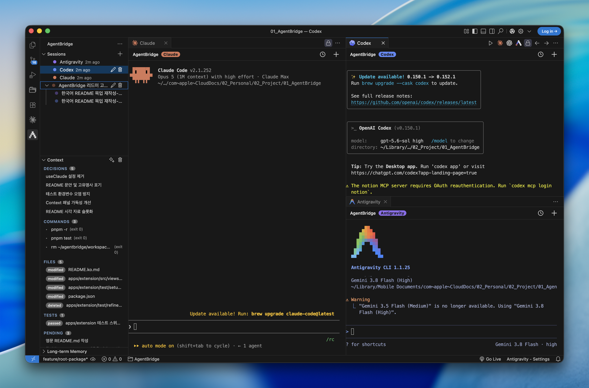
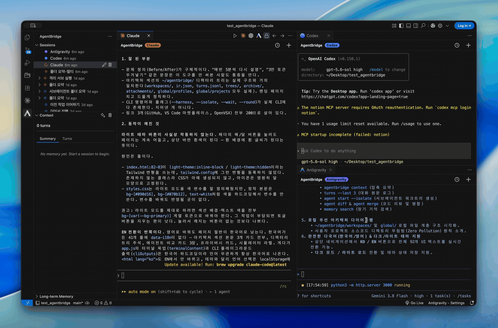
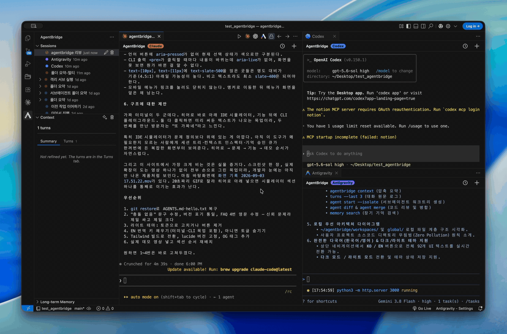
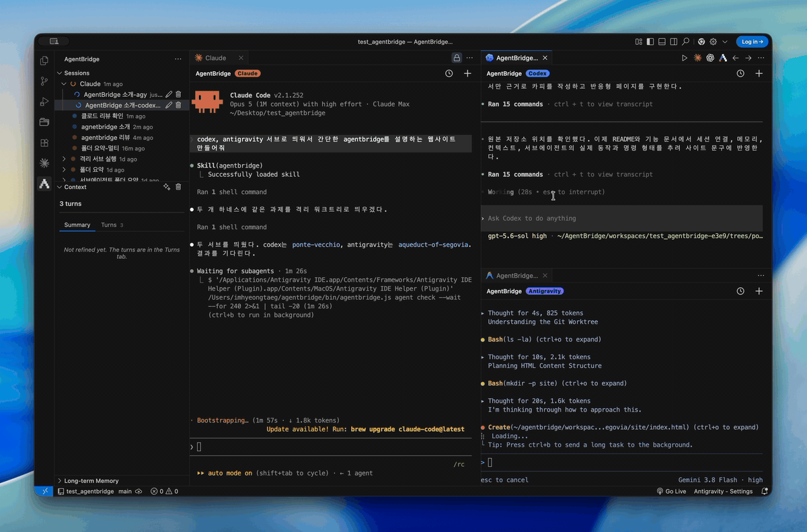
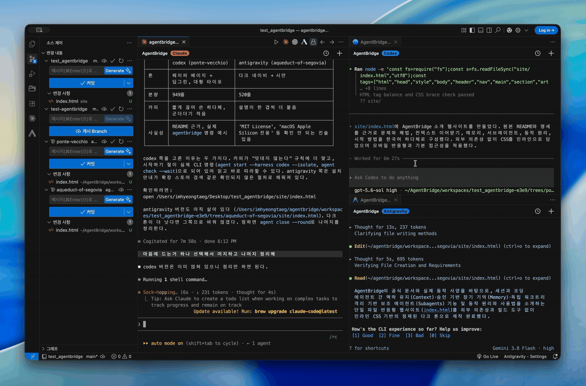
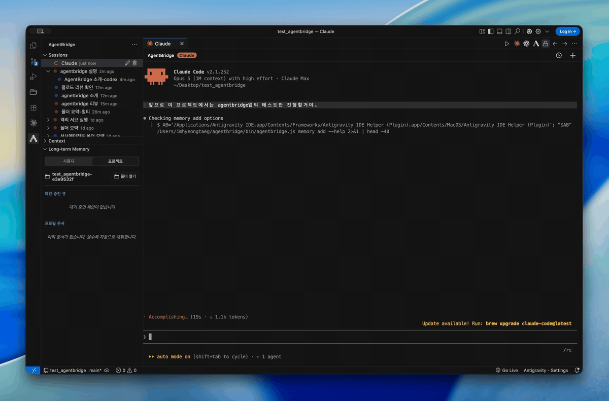

<p align="center">
  <picture>
    <source media="(prefers-color-scheme: dark)" srcset="packages/assets/brand/agentbridge-dark.png" />
    
  </picture>
</p>

<h1 align="center">AgentBridge</h1>

<p align="center">
  
  <a href="LICENSE"></a>
  
</p>

<p align="center"><a href="README.ko.md"><b>한국어</b></a></p>

<p align="center">
  Run Claude · Codex · Antigravity in one workspace on a shared working context.<br />
  Switch models without explaining where you left off.
</p>

<p align="center">
  <a href="https://marketplace.visualstudio.com/items?itemName=h-taek.agentbridge"><b>Marketplace</b></a> ·
  <a href="https://open-vsx.org/extension/h-taek/agentbridge"><b>OpenVSX</b></a> ·
  <a href="https://github.com/h-taek/AgentBridge/releases"><b>Release</b></a>
</p>

<p align="center"></p>

## What it solves

Switching between Claude Code, Codex, and Antigravity means explaining your progress from scratch every time you change models. AgentBridge opens the three CLIs as tabs in one workspace on a shared record of the work: a running summary, the raw turns behind it, and long-term memory about you and the repository.

That record is never pushed into the prompt. The hook adds a single short instruction, and the agent pulls what it needs through the `agentbridge` command when it decides it needs it.

## Who it is for

- People who repeat the same explanation while moving between the three CLIs
- People who want several agents on the same task in one window
- People who want to use the CLIs and subscriptions they already have, with no new account or server

## Features

<table>
<tr>
<td width="50%">
<h3>One workspace, three agents</h3>
<p>Claude, Codex, and Antigravity tabs run side by side. The session tree shows which sessions are working and which have finished.</p>
</td>
<td width="50%"></td>
</tr>
<tr>
<td width="50%">
<h3>Context that survives a model switch</h3>
<p>The summary, the raw turns, and what you have told the agents live in one record, and a new tab pulls only the part it needs — so you do not restate the situation. The injected block runs about 1KB, small enough that recent turns are not pushed out.</p>
</td>
<td width="50%"></td>
</tr>
<tr>
<td width="50%">
<h3>Agents that launch agents</h3>
<p>Ask the agent you are talking to for a helper. The helper opens in its own tab, nested under the parent session, and the parent sends follow-up instructions and reads what the helper recorded.</p>
</td>
<td width="50%"></td>
</tr>
<tr>
<td width="50%">
<h3>Isolated worktrees</h3>
<p>A helper can run in its own git worktree, so two agents editing the same file never collide. While it runs, the worktree appears in the built-in source control view; when it finishes, the changes land in one go — and if a single conflict shows up, nothing lands and your folder is left as it was.</p>
</td>
<td width="50%"></td>
</tr>
<tr>
<td width="50%">
<h3>Memory that needs your approval</h3>
<p>Only durable things are kept — your role, how you work, the conventions of the repository. The agent proposes as it works, and nothing becomes memory until you approve it.</p>
</td>
<td width="50%"></td>
</tr>
</table>

### Also included

- Your CLIs, your subscriptions — no server of ours, no separate account. Model costs stay inside the CLI subscriptions you already pay for.
- Your project folder untouched — hooks and skills install into your own agent settings. No AgentBridge file is written to the repository.
- Cheap background work — summaries and session naming run headless on a CLI you pick. When its quota runs out, the next CLI takes over.
- Drag paths in — hold Shift and drop a file on the chat, and its path lands in the input line as `@path`. Explorer files, editor tabs, and files from outside the IDE all work.
- Sessions that reopen — reopen the IDE and each CLI picks up where it left off through its own `--resume`.
- CLI behavior preserved — permission prompts, tool approval, and session management stay the way each CLI does them.

## Supported agents

AgentBridge runs the CLIs installed on your machine. At least one of the three is required.

| Agent | Command | Install |
|---|---|---|
| Claude Code | `claude` | [claude.com/product/claude-code](https://www.claude.com/product/claude-code) |
| Codex | `codex` | [openai.com/codex](https://openai.com/codex) |
| Antigravity | `agy` | [antigravity.google](https://antigravity.google/product/antigravity-cli) |

To authenticate, run each CLI once and follow its prompts. Antigravity uses `agy /auth`.

To keep background work on a free quota, install and authenticate Antigravity (`agy`). Without it, background work falls back to the model you are talking to and warns you about the token use.

## Install

Search for 'AgentBridge' in the extensions tab. Cursor, Antigravity IDE, and Windsurf use their own extensions tab the same way.

[Marketplace](https://marketplace.visualstudio.com/items?itemName=h-taek.agentbridge) · [OpenVSX](https://open-vsx.org/extension/h-taek/agentbridge) · [Release](https://github.com/h-taek/AgentBridge/releases)

### Getting started

Once installed, an AgentBridge icon appears in the activity bar. Clicking it opens three panels in the sidebar: Sessions, Context, and Long-term Memory.

1. Press the `+` button in the Sessions panel title bar. The AgentBridge icon at the top right of an editor tab does the same thing.
2. Pick a model from the list, and a chat tab opens with that CLI already running.
3. Sessions collect in the Sessions panel. Click one to reopen it, or hover a row to rename or delete it.
4. The Context panel holds the running summary and the raw turns; the Long-term Memory panel holds proposals waiting for approval.

When you need a helper, just say so to the agent in the chat tab. Launching one, checking on it, reading its result, and merging its changes are already in its skills.

## How it works

- Your local CLIs, run directly — AgentBridge starts the CLIs you have already authenticated in a terminal session of its own. No relay server sits in between.
- Context on demand — the hook carries a short instruction rather than a copy of your memory. The agent pulls the summary or the recent turns it needs, so the prompt stays small and the record stays whole.
- Your project folder intact — hooks and skills install into a marked block inside your own settings, leaving the rest alone. Everything is stored under `~/agentbridge/`, and `agentbridge uninstall` removes the hooks.
- Shift-drag to insert paths — the chat intercepts a drag ahead of the IDE only while Shift is held. Paths from the explorer and editor tabs are read as they are; files from outside the IDE are copied into `~/agentbridge/attachments/` and that path is inserted. The notation is `@path`, which all three CLIs understand.

## Settings

VS Code settings (`settings.json` or the settings UI):

| Key | Default | Description |
|---|---|---|
| `agentbridge.refine.policy` | `active` | Policy for picking the CLI that handles background work |
| `agentbridge.refine.priorityOrder` | `[agy, codex, claude]` | CLI try order under the `priority` policy |
| `agentbridge.refine.fixedCli` | `agy` | CLI pinned under the `fixed` policy |
| `agentbridge.turns.assistantDetail` | `compact` | How much of each answer to keep in the turn record |
| `agentbridge.memory.maxArchiveSnapshots` | `15` | How many previous snapshots to keep |

## Where data lives

Everything is stored under `~/agentbridge/`, split per project folder.

```
~/agentbridge/
├── workspaces/<folder>-<hash>/
│   ├── workspace.json      ← sessions and state
│   ├── ir.json             ← the running summary
│   ├── turns.jsonl         ← raw turns
│   ├── archive/            ← previous snapshots
│   ├── sessions/<id>/      ← per-tab replay buffer, hook signals
│   └── trees/<name>/       ← isolated subagent worktrees
├── attachments/            ← files dropped into the chat
└── global/
    ├── profiles/default/   ← what is known about you
    └── projects/<repo>/    ← what is known about this repository
```

Each agent's global settings file gains one marked block for the hooks and skills, and nothing else changes.

```
~/.claude/settings.json          ~/.claude/skills/agentbridge/
~/.codex/hooks.json              ~/.agents/skills/agentbridge/
~/.gemini/config/hooks.json      ~/.gemini/config/skills/agentbridge/
```

## Privacy

AgentBridge runs no server of its own. Your messages go through the CLIs you authenticated, to the backends those CLIs already talk to (Anthropic · OpenAI · Google). Background work such as summaries and session naming runs on the same CLIs, and the results are stored on your machine.

Nothing else leaves your machine. There is no analytics, no telemetry, no third-party service. Session records, turn logs, memory, and terminal replay buffers are all local files.

## License

[MIT](LICENSE) © h-taek

The long-term memory module adapts code from [gc-tree](https://github.com/handsupmin/gc-tree) (MIT). See [NOTICE](NOTICE).
